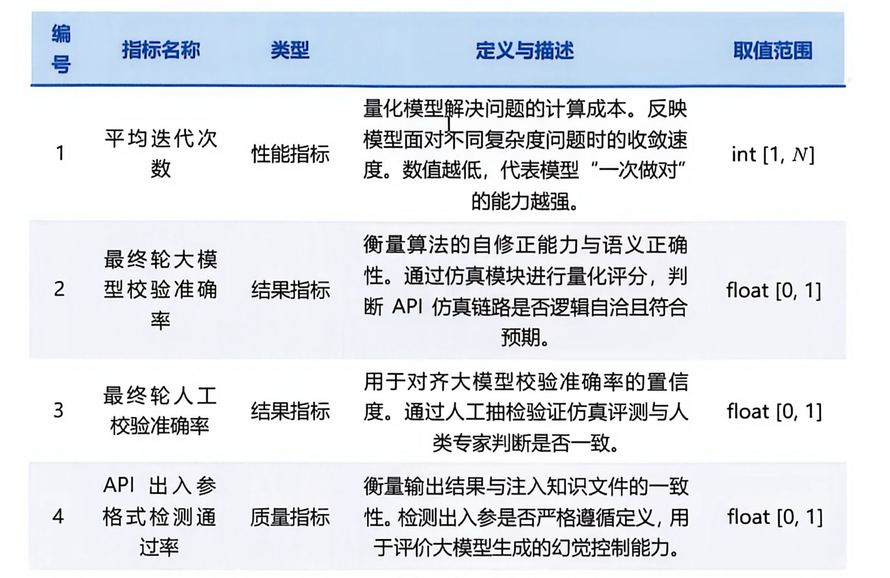
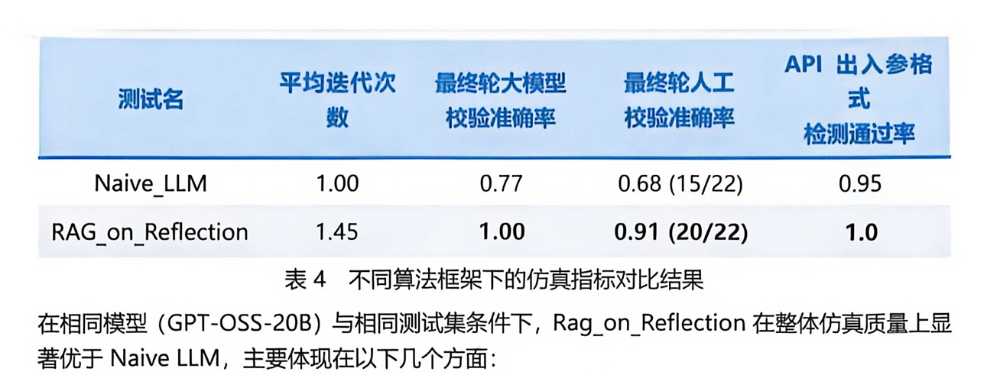
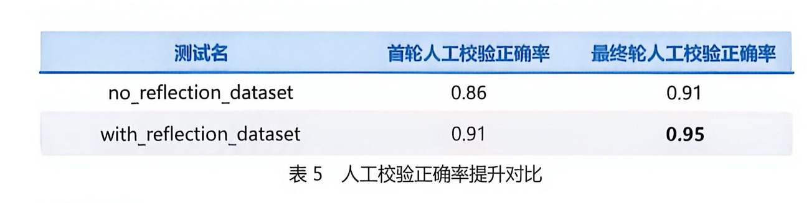
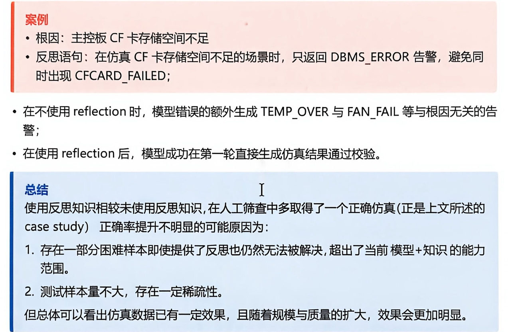

# 数据飞轮

**项目简介**：

这个项目是面向网络故障排障场景的 API 仿真数据生成系统，整体采用“知识准备—模型生成—结果校验—反思修正—知识沉淀”的闭环架构。

输入是一条包含故障类型、排障步骤和涉及 API 的样本。系统首先从领域知识、历史反思知识和 API Schema 三类知识源中检索上下文。检索层结合 metadata 过滤、BM25 关键词召回和向量召回，并使用 RRF 统一排序。自适应路由会根据 API 数量、排障步骤数量和历史反思命中情况，动态调整不同知识源的 topK 与权重。

知识准备完成后，Worker 根据样本、Schema、领域知识和历史 Reflection 生成模拟 API 调用结果。Advisor 可以结合当前会话中已经出现的 API 信息进行调整。随后系统通过 Validator 校验 API 覆盖率、调用顺序、URL、Method、必填参数以及整体质量。

如果结果通过校验，则提前结束；如果未通过，Tutor 会根据生成结果和校验反馈产生新的结构化反思，并在下一轮重新注入 Worker。达到最大轮数仍未通过时，系统返回失败结果，同时把高价值反思作为候选知识，经质量评分和人工审核后再进入知识库。

工程层面还包括 Pipeline Trace、LLM/Embedding 缓存、熔断降级、FAISS/pgvector 后端切换和 RAG 离线评测。项目核心不是简单调用大模型，而是把检索、生成、确定性校验、反思与知识治理串成闭环。

###  为什么要设计领域知识、反思知识和 API Schema 三类知识源？

参考回答：

三类知识解决的是不同问题，不能简单混在一起等权检索。

领域知识主要回答“为什么会发生这个故障、应该按照什么排障逻辑处理”，例如根因、告警关联和排障步骤。它决定生成结果在业务语义上是否合理。

API Schema 主要回答“应该调用哪个接口、URL 和 Method 是什么、输入输出字段有哪些”，它属于强约束知识。如果只依靠大模型记忆，模型很容易编造接口名称或参数字段，因此 Schema 要以单个 API 为粒度构造完整 Chunk，并根据当前样本中的 `api_name` 精确过滤。

反思知识记录历史失败，例如某类故障中经常遗漏哪个接口、调用顺序为什么错误、哪些参数不能编造。它解决的是“如何避免再次犯同样的错误”，因此经过人工审核的反思知识默认权重高于普通领域知识。

项目通过统一的 `Document` 和 metadata 规范管理三类知识，但为它们设置不同过滤条件、topK 和权重。领域知识和反思知识按 `fault_type` 过滤，API Schema 按 `api_name` 过滤；默认 topK 分别为2、2、4，权重为1.0、1.2、0.9。

这种设计既保留了统一检索接口，又防止不同性质的知识相互污染。相比把所有文本直接放进一个向量库，它的可解释性和可控性更强，也方便分别评估各知识源的覆盖率与实际收益。

### 1. Metadata 是如何进行过滤的？

我在项目中把领域知识、反思知识和 API Schema 统一抽象成 `Document`，其中正文参与 BM25 和向量相似度计算，metadata 不直接参与语义打分，而是承担“限定检索范围”的作用。统一字段包括 `knowledge_type`、`source_id`、`fault_type`、`api_name`、`api_url`、`http_method`、`validator_score`、`failed_rule` 和 `quality_level` 等。

过滤分为两个层次。第一层是知识类型过滤。每次检索领域知识时，会自动加上 `knowledge_type=domain_knowledge`；检索反思知识时加 `reflection_knowledge`；检索接口契约时加 `api_schema`，避免三类知识相互污染。第二层是业务字段过滤：领域知识和反思知识按照当前样本的 `fault_type` 精确过滤，确保召回的是同类故障；API Schema 则根据样本实际涉及的 `api_name` 列表过滤，避免把无关接口定义注入 Prompt。

具体匹配规则是：多个字段之间采用 AND；过滤值为标量时要求相等；过滤值为列表时采用集合命中，也就是字段命中列表中的任意一个即可；如果文档字段本身也是列表，则判断两边是否存在交集。例如：

```
knowledge_type = api_schema
AND api_name IN [getAlarm, queryDevice]
```

在本地 FAISS 模式下，由于索引本身不保存 metadata，我会先让各检索器扩大候选召回，再在知识库层根据 chunk index 找回原始文档并做后过滤。这里要注意一个风险：后过滤可能导致最终数量不足，因此 `per_retriever_top_k` 通常要大于最终 `top_k`。在 PostgreSQL + pgvector 模式下，metadata 存在 JSONB 字段中，通过 `metadata @> filter::jsonb` 在数据库侧预过滤，并建立 GIN 索引，再执行 HNSW 排序，效率更高。

最后，不同类型知识分别设置 topK 和权重，再使用加权 RRF 融合。这样 metadata 负责保证“候选知识正确”，BM25 和向量检索负责判断“候选知识相关”，两者职责是分开的。

------

### 2. 还有哪些关键词检索方法？为什么选择 BM25？

关键词检索常见方案

首先是倒排索引加布尔检索。它建立“词到文档”的映射，通过 AND、OR、NOT 判断文档是否包含关键词。它速度快、可解释，适合精确过滤，但只能判断是否命中，缺少比较细致的相关性排序。

第二类是 TF-IDF。TF 表示一个词在当前文档中的出现频率，IDF 用来降低常见词的权重，两者相乘衡量关键词对文档的重要程度。它比布尔检索更适合排序，但原始 TF 会随词频近似线性增长，长文档也容易因为词更多而获得不合理优势。

第三类是 BM25，它可以看成对 TF-IDF 的工程化改进。它仍然基于倒排索引和 IDF，但通过 `k1` 对词频增长进行饱和控制，即一个词重复出现十次不会获得十倍收益；通过 `b` 按平均文档长度进行归一化，减少长文本天然占优的问题。项目中采用的是 BM25Okapi，参数为 `k1=1.5`、`b=0.75`，新增知识后延迟重建索引，并支持索引状态持久化。

此外还有 BM25+、BM25L，可以改善短文档或超长文档的评分偏差；Elasticsearch 还支持短语检索、模糊匹配和字段级加权；学习型稀疏检索如 SPLADE，会用模型扩展词项并生成稀疏向量，语义能力更强，但训练、部署和推理成本也更高。

我选择 BM25，主要因为项目中存在大量不能只依靠语义近似的强标识符，例如 API 名称、URL、HTTP Method、告警码和参数字段。向量检索可能认为两个语义相近的接口都相关，但 BM25 对准确词项更加敏感，可以补足向量召回。与此同时，BM25 无需训练、CPU 即可运行、索引体积较小、结果容易解释，很适合作为混合检索的一路召回。

项目当前默认 tokenizer 是按空格切分，因此它更擅长 API 名称、英文标识符和已经分词的文本。对于纯中文知识，这是一个明确的改进点：生产化时应接入结巴、HanLP 或 **Elasticsearch** 中文分词器，而不能把现有实现描述成完整的中文检索方案。

------

### 3. HNSW 的核心原理是什么？项目中的参数如何权衡？

参考回答：

HNSW 是基于多层近邻图的近似最近邻算法。底层保存较密集的邻接关系，高层节点更少、连接跨度更大。查询时从高层入口点开始，贪心移动到更接近 Query 的节点，然后逐层向下，最终在底层扩展候选集合。

项目中的主要参数是：

```
M = 16
ef_construction = 64
ef_search = 40
```

`M` 表示每个节点维护的邻居数量。M 越大，图连接越充分，召回率通常越高，但内存占用和建图成本也会上升。

`ef_construction` 控制建立索引时搜索候选邻居的范围。值越大，构建出的图质量越高，但入库和索引构建更慢。

`ef_search` 控制查询阶段维护的候选集合大小。值越大，越有机会找到真实近邻，但查询延迟也越高。它适合通过线上或离线压测动态调整。

选择 HNSW 而不是 IVF，主要因为项目的数据规模中等，要求较高召回率，而且反思知识会持续增量写入。HNSW 不需要提前训练聚类中心，对增量更新更友好。IVF 通过 K-Means 把向量分桶，数据规模很大、内存敏感时更有优势，但聚类质量依赖训练数据，分布变化后可能需要重新训练。

参数不能凭经验永久固定。应使用项目的标注查询集，在不同 `ef_search` 下测量 Recall@K、P95 延迟和数据库资源占用，再确定生产参数。

------

### 4. 自适应路由是如何设计的？

我的自适应路由不是让 LLM 再做一次分类，而是设计成了基于样本特征的可解释规则路由。这样做的原因是路由处于生成链路前端，如果它本身依赖一次大模型调用，不仅会增加时延和成本，还可能引入新的不稳定性。路由输入主要包括故障类型、排障步骤数量、涉及的 API 数量，以及当前故障是否存在经过沉淀的历史反思知识。

系统先从一个均衡基线开始：领域知识默认 `topK=2、weight=1.0`，反思知识为 `topK=2、weight=1.2`，API Schema 为 `topK=4、weight=0.9`。反思权重略高，是因为它记录了历史生成失败和修正经验，对避免重复错误更有价值；API Schema 默认多取一些，是因为一个样本通常会涉及多个接口。

之后根据特征动态调整。第一条规则是 API-heavy：当 API 数量达到阈值 3 时，提高 API Schema 权重 0.35，并把其 topK 至少扩展到 API 数量，保证每个实际接口都有机会召回完整契约。第二条是 complex-troubleshooting：当排障步骤不少于 4 步时，认为链路较复杂，将领域知识和反思知识的 topK 至少提高到 3，同时分别增加 0.15 和 0.20 的权重。第三条是 reflection-boost：如果当前 `fault_type` 命中历史反思集合，再将反思知识 topK 提到至少 3、权重增加 0.35，优先复用同类失败经验。这几条规则可以叠加，例如最终策略可能是 `balanced+api_schema_heavy+complex_troubleshooting+reflection_boost`。

路由还会同步产生 metadata filter：领域知识和反思知识绑定当前 `fault_type`，API Schema 绑定本次 `api_name` 列表。每一路按照动态 topK 召回后，再以动态权重执行跨来源加权 RRF，公式可以概括为 `weight/(k+rank)`，避免直接比较 BM25 分数和向量距离这种不同量纲的数据。

### 5. 如何召回 Chunk？

项目中的召回链路可以概括为“构造 Chunk → 生成查询 → 多路召回 → metadata 过滤 → 汇总候选”。

首先，知识入库时统一转换为 `Document`，每个 Document 包含 `key`、`content`、`metadata` 和唯一的 `chunk_index`。不同知识的切分方式有所区别：领域知识通常按故障类型或文本行切分；反思知识按一条完整的历史反思构造 Chunk；API Schema 则以单个 API 为粒度，把名称、URL、Method、说明、入参和出参序列化到同一个 Chunk 中。这样做是为了保持接口契约的完整性，避免把入参和出参切到不同片段。

检索时，我会从当前样本提取故障类型、排障步骤和 API 名称，拼成统一 Query：

```
fault_type + troubleshooting_steps + api_names
```

然后对三类知识分别配置 topK 和 metadata filter。例如，领域知识和反思知识限定当前 `fault_type`，API Schema 限定本次涉及的 `api_name`。每个知识库内部同时执行两路召回：

- BM25 根据查询词在 Chunk 中的词频、逆文档频率和文档长度计算相关性，擅长召回 API 名、告警码、字段名等精确匹配内容。
- 向量检索先对 Query 生成 Embedding，再计算它与知识向量的距离。本地模式使用 FAISS `IndexFlatL2` 做精确最近邻检索；工程化模式使用 pgvector + HNSW 做近似最近邻检索。

每个 Retriever 先返回 `per_retriever_top_k` 个候选，结果格式为“检索分数 + chunk_index”。系统再通过 `chunk_index` 找到原始 Document，检查其 metadata 是否满足过滤条件。FAISS 不原生存储 metadata，因此是在知识库层后过滤；pgvector 则可以先通过 JSONB 条件在数据库中缩小范围，再执行向量排序。

这里 `per_retriever_top_k` 通常大于最终 topK，例如两路检索分别先取 10 条，融合后只返回前 2～4 条。这可以为后续融合保留足够候选，也能降低 metadata 后过滤造成结果不足的概率。最终召回的不是单纯“最相似文本”，而是在知识类型和业务范围正确的前提下，同时兼顾精确词项与语义相似度的 Chunk。

------

### 如何对检索到的数据进行重排？

严格来说，当前项目没有接入 Cross-Encoder 或 LLM Reranker，而是采用了两级基于排名的融合重排。面试时我会明确这一点，避免把检索融合夸大成模型重排。

第一级是在单个知识库内部，对 BM25 和向量检索返回的候选使用 RRF，也就是倒数排名融合。它不直接比较 BM25 分数和向量距离，因为两者含义和数值范围完全不同：BM25 通常分数越大越相关，而 L2 距离越小越相关。RRF 只关心某个 Chunk 在各检索器中的名次，计算方式是：

```
RRF(chunk) = Σ 1 / (k + rank)
```

例如某个 Chunk 在 BM25 中排第 1、向量检索中排第 3，那么它会同时获得两路排名贡献；只被一路召回的 Chunk 则只有一项贡献。这样同时获得关键词和语义认可的内容更容易排到前面。项目还保留了分数融合模式，即先对各检索器分数做 Min-Max 归一化再求和，但默认更倾向 RRF，因为它对不同检索器的分数尺度更鲁棒。

第二级是跨知识来源重排。领域知识、反思知识和 API Schema 分别完成内部召回后，再执行加权 RRF：

```
fused_score = source_weight / (cross_source_rrf_k + source_rank)
```

默认权重分别是领域知识 1.0、反思知识 1.2、API Schema 0.9。反思知识权重较高，是因为经过审核的历史失败经验对当前生成有较强纠错价值。权重不是固定不变的：自适应路由会根据 API 数量、排障步骤复杂度以及是否存在同类反思，动态提高某类知识的 topK 和权重。

融合结果按照 `fused_score` 降序排列，同时设置 `max_per_type`，例如领域知识最多 2 条、反思知识最多 2 条、Schema 最多 4 条，防止某一种知识占满上下文窗口。最后把保留下来的正文连同知识类型、来源和融合分数格式化后注入 Worker Prompt。

这套方案的优势是计算开销小、结果稳定、每个排名都可以追溯；不足是它主要利用召回名次，没有对 Query 与候选 Chunk 做更深层的交互理解。如果知识量继续扩大，我会在 RRF 之后增加一个轻量 Cross-Encoder，只对前 20～50 个候选进行相关性打分，再结合业务权重输出最终 topK，从而形成“宽召回、粗排、精排”的三级结构。

###  如何评估这个项目是否真的有效？

检索层使用 Recall@K、MRR、NDCG 和 source coverage。Recall@K 衡量正确知识是否进入前K条；MRR关注第一个正确结果的位置；NDCG适合一个查询存在多条不同相关等级知识的情况；source coverage 用于判断领域知识、反思知识和 Schema 是否都有合理覆盖。

生成层主要看 API 覆盖率、调用顺序正确率、URL/Method 正确率、必填字段完整率、结构解析成功率和 Validator 通过率。

Reflection 层要比较首次通过率、平均迭代轮数、最终通过率，以及引入反思知识后同类错误的复发率。如果加入 Reflection 后只是轮数增加但通过率没有提升，说明 Tutor 或反思检索没有产生实际价值。

###  如果线上请求量提升十倍，你会如何优化？

参考回答：

我会先通过 Trace 和压测确定瓶颈，而不是直接增加机器。这个项目最可能的瓶颈是 LLM 调用、Embedding 调用、Cross-Encoder 精排、数据库向量检索和多轮 Reflection。

第一步减少远程调用。Embedding 对相同模型和文本做内容哈希缓存；LLM 对确定性 Prompt 做短期缓存；Schema 等静态知识提前完成向量化，不在请求路径重复构建。

第二步批处理和并发控制。Embedding 入库采用批量请求；Cross-Encoder 对多个 Query-Chunk 对批量推理；不同样本可以并发，但单样本内部有依赖的 Worker、Validator、Tutor 仍需顺序执行。

第三步减少无效上下文。通过 metadata 预过滤、自适应 topK 和最大知识条数限制控制 Prompt 长度，降低 LLM 首 Token 延迟和费用。

第四步进行模型分级。Worker 和 Tutor使用能力较强的模型，简单 Validator 使用小模型，确定性问题交给规则。失败样本才进入第二轮 Reflection，成功样本立即退出。

第五步完善降级。向量服务失败时可使用 BM25；LLM 连续失败触发熔断器；高负载时降低 topK 或关闭非关键 Advisor。

最后根据容量评估决定是否拆分服务。当 PostgreSQL 单机无法满足向量数量或 QPS 时，再迁移到专用向量数据库；当模型成为瓶颈时，通过独立推理服务、动态批处理、量化和多副本扩容解决。

这个项目把“缓存、重试、熔断、降级”设计成四层防护，处理的是不同类型的问题：

```
先查缓存 → 未命中才请求远程服务 → 短暂错误重试
→ 连续失败后熔断 → 使用可用的本地能力降级
```

### LLM 缓存如何设计

LLM 调用前，系统使用以下字段构造缓存键：模型名称、完整 messages、temperature、top_p 和 max_tokens

这些字段经过排序序列化后计算 SHA-256，得到固定长度的缓存 Key。之所以必须包含模型、完整消息和采样参数，是因为其中任何一个发生变化，返回结果都可能不同。如果只按照 Prompt 缓存，更换模型或 temperature 后可能错误复用旧结果。

命中缓存时直接反序列化为 `LLMCompletionMessage`，不会进入远程调用和熔断器；未命中时才调用模型，成功后将完整结果写入 JSON 文件。当前 LLM TTL 为86400秒，也就是一天。

LLM 缓存时间较短，因为 Prompt、反思知识和模型服务可能变化，而且生成结果本身具有一定随机性。项目将 temperature 设为0，使结果更稳定，也提高了缓存复用的合理性。

这样设计首先是为了保证正确性。因为即使 Prompt 相同，只要模型或采样参数不同，输出分布就可能变化。如果缓存 Key 不包含这些参数，就可能把旧模型或其他生成策略的结果错误返回。

但它确实存在命中率问题。这个项目中的 Worker Prompt 会包含当前样本、检索知识、历史 Reflection 和迭代轮次，所以不同样本之间完整 Prompt 基本不会相同。这个缓存主要对以下场景有效：

- 开发和回归测试中重复运行同一个样本；
- 请求超时后对完全相同的任务重新执行；
- 重复提交或消息队列重复消费；
- Validator 使用相同输入重复评分；
- Pipeline 异常重启后恢复同一个任务。

因此我不会把精确响应缓存作为线上主要的性能优化手段，它更偏向去重、降低测试成本和保证可复现性。

生产化时我会采用分层缓存：

第一层是本地精确响应缓存，继续保留现有 SHA-256 方案，处理重复任务。

第二层是稳定前缀缓存。系统 Prompt、API Schema、领域规则等内容变化频率低，可以把它们固定在 Prompt 前部，利用模型服务端的 Prompt Prefix Cache。这样即使用户问题不同，公共前缀仍然能够复用 KV Cache。与完整响应缓存相比，这种方式的实际命中率通常更高。**语义缓存则需要谨慎**。语义相近的两个问题不代表可以复用同一个答案，特别是 API 名称、Method 或参数稍有差异时，错误复用的风险很高。如果使用语义缓存，我只会把它用于低风险的知识问答，并设置较高相似度阈值

###  Embedding 缓存如何设计

Embedding 的缓存键更简单：

```
{
    "kind": "embedding",
    "model": model,
    "input": text
}
```

模型和文本相同，向量结果通常就是确定的，因此缓存 TTL 设置为604800秒，也就是七天，比 LLM 更长。

Embedding 缓存主要用于知识库重复构建、测试重复执行和相同 Query 重复出现的场景。它可以减少远程调用成本，也能避免测试过程中因为服务波动导致向量发生变化。

缓存按照 namespace 隔离，例如 `dashscope-embedding` 和 `llm_glm-5.2` 使用不同目录，防止不同服务的缓存互相污染。缓存读取失败、文件损坏或 JSON 解析异常时，系统把它当作未命中，而不是让整个 Pipeline 失败。

embedding缓存更容易命中，因为同一个模型对同一段Chunk通常产生固定向量。它的Key是模型加输入文本，TTL设置为七天；LLM缓存TTL是一天。Embedding服务通过OpenAI兼容接口调用，文档入库和查询必须使用同一个模型。项目显式配置1024维，候选模型主要是BGE-M3和Qwen3-Embedding-0.6B，最终通过Recall@K、MRR、延迟和成本选型。

###  熔断器如何工作

项目的熔断器包含三个状态：

```
CLOSED → OPEN → HALF_OPEN → CLOSED
```

正常情况下处于 `CLOSED`，所有请求正常通过。项目当前配置是：

```
failure_threshold: 3
recovery_timeout_seconds: 30
success_threshold: 1
```

当远程 LLM 连续失败3次后，熔断器进入 `OPEN`。在接下来的30秒内，新请求不会再访问远程模型，而是立即抛出 `CircuitBreakerOpenError`。这样可以防止已经不可用的模型服务被大量请求持续冲击，也避免每个业务请求都等待超时。

30秒后，下一次请求会把状态切到 `HALF_OPEN`，相当于放行一个探测请求。如果探测成功一次，熔断器恢复到 `CLOSED`；如果探测仍然失败，则立即重新打开，再等待下一个恢复周期。

一次正常请求成功后，连续失败计数会清零。因此当前触发条件是“连续失败”，而不是一个时间窗口中的累计错误数。

### 5. 熔断与重试如何配合

LLM 请求本身最多重试6次，主要处理网络异常、客户端请求异常和非200响应。重试解决的是短暂网络抖动，熔断解决的是服务持续不可用。

当前代码中，每次失败都会经过熔断器计数，因此虽然最大重试次数是6次，但连续失败达到3次后熔断器会打开，后续请求可能直接被拒绝，不一定真的完成6次远程请求。这个设计能够减少故障期间的无效重试，但参数语义需要明确，否则维护者可能误以为一定会调用6次。

生产化时我会进一步区分异常处理，我不会把所有异常都放进熔断器。连接超时、HTTP 408和5xx代表下游服务可能不可用，可以指数退避+随即抖动重试并计入熔断；429表示被限流了，可能会切换备用额度；400、413、401和403属于请求或配置问题，重复调用没有意义，这不是模型服务的可用性问题。所以不重试也不计入熔断，应立即告警；200但响应结构异常可以有限重试；Validator不通过属于生成质量问题，应进入Reflection，而不是熔断模型服务。

当前熔断器捕获所有异常，存在把参数错误和服务故障混在一起统计的问题，这是可以改进的地方。

#### 如果agent工具调用失败

会把工具调用拆成「决策 -> 校验 -> 执行 -> 确认 -> 恢复」五个阶段，每个阶段使用不同的处理方式。

1. 模型选错工具、JSON 不合法或缺少参数时，先用结构化输出和 Schema 拦截，再把明确的校验错误交给模型重生成。
2. 参数满足 Schema 后，服务端还要检查业务约束、用户身份、工具权限和风险级别，不能信任模型自己判断权限。
3. 进入执行阶段后，我只对限流、连接失败和部分 5xx 这类瞬时故障做有界重试，并同时满足三个条件：调用可以安全重放、总时间预算还有余量、重试次数没有超限。退避要加抖动，遇到 `Retry-After` 就尊重服务端建议。参数错误、权限不足和明确的业务失败应该修参数、重新规划或询问用户，不能原样重试。
4. 付款、发邮件、创建订单这类工具还要处理「结果未知」。我会在第一次调用前生成幂等键并写入 Checkpoint，重试和恢复时复用同一个键；超时后先按幂等键查询状态，确认没有执行再决定是否重试。查不清时暂停任务并转人工，避免重复副作用。
5. 系统还需要熔断、降级、故障转移和统一的结构化错误。Trace 里记录每次调用的工具版本、参数摘要、耗时、重试决策、幂等键摘要和最终状态，敏感参数要脱敏，方便告警、复盘和审计。

### 6. 降级策略如何设计

项目当前明确落地的是 MCP 的 `fail_open` 降级。MCP Server 超时、连接失败、缺少依赖或工具返回错误时，如果配置：

```
fail_open: true
```

客户端会记录 Warning 并返回 `None`，Pipeline 随后继续使用本地 API JSON、已有 Prompt 上下文和 Rule Validator，不会因为增强型工具不可用而中断仿真任务。

对于 LLM，当前实现已经具备“缓存优先”：即使熔断器处于 OPEN，只要相同请求存在有效缓存，仍然可以返回结果。但如果缓存未命中，当前代码会抛出异常，并没有真正实现备用模型自动切换。

更完整的生产降级顺序应该是：

```
主模型
→ 同模型有效缓存
→ 备用小模型或本地模型
→ 对非生成环节使用规则结果
→ 标记任务待重试，而不是返回伪造结果
```

Embedding 服务不可用时，可以先使用有效缓存；如果新文本没有缓存，则对检索降级为 BM25，并降低结果置信度。不能随机生成一个向量，否则会污染向量索引。MCP 不可用则回退本地 Schema 与规则校验。

之所以这样设计，是因为该项目生成的是仿真数据，允许在保留告警和可追踪信息的前提下部分降级；但不能为了“成功返回”而静默生成不可信结果。对于 Schema 校验等确定性约束，可以使用本地规则兜底；对于缺失的生成能力，则应明确失败或进入重试队列。这样才能同时兼顾可用性、数据质量和故障可追溯性。

可以。结合 [rag-reflection.pdf](D:/Document/招聘-资料/项目/rag-reflection.pdf) 后，我认为除了前面讨论过的 RAG、BM25、HNSW、缓存和 Trace，面试官很可能沿着“文档中的数据、模块描述和工程接口”继续深挖。下面这些问题尤其值得准备。

## 一、评测可信度

#### 评测指标：



对22条随机抽样样本的评测集进行的消融实验，（最终轮大模型校验准确率应为外部离线大模型检测出的结果）



反思数据集消融实验：另测试模型第一轮生成质量，即对模型第一轮生成结果进行校验，观察在第一轮引入反思知识后是否能提高模型首轮正确率，仿真运行模型为环境模型QWQ



举例：




------

### 3. Reflection 数据集会不会造成测试集泄漏？

参考回答：

存在这种风险。项目按照 `base_fault` 召回反思知识，如果测试样本对应的反思是由同一条样本或高度相似样本产生的，那么首轮准确率提升可能来自答案泄漏，而不是模型真正学会了可泛化经验。

正确做法是按照故障实例、设备或时间划分训练集和测试集，而不是随机拆分文本。由测试样本产生的 Reflection 不能进入测试时使用的知识库。还应区分“同根因泛化”和“同样本复现”：允许召回同类故障经验，但不能包含该测试样本的目标答案、实体ID或完整 API 链路。

反思知识还应做去实体化，把具体资源ID改写为通用规则，降低记忆答案的可能。

------

## 二、Reflection 与退出机制

### 4. 为什么最多迭代5轮？如何确定最佳轮数？

参考回答：

5轮是防止 Reflection 无限循环的工程保护值，不是理论最优值。轮数越多，可能提高复杂样本通过率，但同时增加模型调用成本、延迟和错误累积风险。

更合理的确定方式是统计验证集上每轮带来的边际收益。例如第一轮到第二轮通过率提升明显，但第四、第五轮几乎没有提升，就应提前停止。除了最大轮数，还可以根据连续两轮分数无提升、错误类型重复、输出变化过小、总 Token 预算或时间预算退出。

生产环境中我会采用“双预算”：最大轮数加最大时间，同时保存 `best-so-far`，即历史上 Validator 分数最高且硬规则错误最少的结果，而不是简单返回最后一轮。

------

### 5. 超过10分钟后为什么返回最后一轮结果？如果最后一轮更差怎么办？

参考回答：

文档中的目标是保证系统可用性，所以超时后不再继续消耗资源。但直接返回最后一轮存在问题：Reflection 并不保证单调优化，后一轮可能修复调用顺序，却新增字段错误。

因此应在每轮结束后计算统一质量指标，保存当前最佳结果：

```
硬规则是否通过
→ API覆盖率
→ Schema字段正确率
→ Validator分数
→ 业务语义评分
```

超时时返回最佳历史结果，并明确标记 `termination_reason=timeout`、`validation_passed=false`，而不能把“流程结束”当成“校验通过”。

当前代码中的 `early_exit_check` 把“分数达标”和“时间达到阈值”都返回 `True`，调用方容易将超时误认为成功，这是需要修正的实现边界。两个概念应拆开：

```
should_stop
validation_passed
termination_reason
```

------

### 6. Tutor 生成的 Reflection 如何保证真的有效？

参考回答：

不能只判断反思语句是否通顺，而要判断它是否具有可执行性、归因是否正确，以及是否改善下一轮结果。

一条高质量 Reflection 应包含错误对象、错误原因和修正动作，例如“CF存储不足场景只应返回 DBMS_ERROR，不应额外生成 CFCARD_FAILED”，而不是“请提高结果准确性”这种空泛描述。

系统可以通过三种方式验证：第一，检查下一轮是否修复了对应规则；第二，在同类故障的独立样本上验证是否提升；第三，检查是否引入新的错误。只有跨样本有效、没有明显负作用的反思才进入正式知识库，其余进入人工审核队列。

------

## 三、指导模块与跨轮一致性

### 8. 跨轮实体一致性是如何保证的？

参考回答：

系统通过 `session_id` 隔离不同任务的历史 API 数据。每轮完成后，将 API 名称、输入参数和输出参数保存到 `ExistingApiStore`。下一轮 Advisor 会读取同一 session 下的历史结果，根据 `parameter_mapping` 和相同实体标识进行一致性修正。

例如上一轮某接口返回 `portResId=A`，下一轮查询该端口状态时，就应该继续使用A，而不能生成新的随机ID。指导模块还会记录修改字段和传播目标，便于追踪一次修正影响了哪些后续调用。

不过当前一致性仍有部分依赖 LLM。生产化时应把实体关系抽象为显式的依赖图，对强一致字段采用确定性传播规则，LLM只处理无法规则化的语义关系。

------

## 四、异步任务与并发

### 10. 为什么接口采用“发布任务+轮询查询”，而不是同步返回？

参考回答：

完整 Pipeline 可能包含多轮 Worker、Validator 和 Tutor 调用，最坏可能运行数分钟。如果使用同步 HTTP 请求，容易遇到网关超时、客户端断开和连接长期占用。

因此提交接口只负责校验参数、生成 `task_id` 并写入任务队列，立即返回；后台 Worker 执行任务；查询接口根据 `task_id` 返回 `pending`、`running`、`success` 或 `failed`。

这种方式可以解耦请求生命周期和推理生命周期，也方便限制模型并发。但当前任务队列和结果字典都在进程内存中，服务重启后任务状态会丢失，而且多实例部署时状态无法共享。

生产化应使用 Redis、RabbitMQ 或 Kafka 存储任务，使用数据库或对象存储持久化结果，同时支持超时、重试、幂等和死信队列。

------

### 11. 用户重复提交同一个任务怎么办？如何保证幂等性？

参考回答：

当前接口每次都会生成新的 UUID，因此相同请求可能被重复执行，造成模型调用浪费。

生产化时可以由调用方传入 `request_id`，或者使用：

```
用户/租户 + session_id + 输入内容摘要 + 版本
```

生成幂等键。提交时通过数据库唯一约束或 Redis `SET NX` 保证同一任务只入队一次。如果已有任务正在运行，就返回原 task_id；如果已经成功，就直接返回已有结果。

但幂等范围不能只根据 Prompt，因为知识库版本或模型版本变化后，用户可能确实需要重新运行，因此幂等键还应包含 Pipeline 版本。

------

## 五、文档中特别容易被追问的设计问题

### 13. 文档称系统只需要300MB内存，这个数据是否包括模型？

参考回答：

不包括完整大模型显存。当前 LLM 和 Embedding 通过远程服务调用，300MB主要指 Python Pipeline、知识文件、任务状态和本地索引在特定测试规模下的进程内存。

如果使用本地 BGE-M3、Qwen Embedding 或生成模型，模型权重、KV Cache 和推理框架占用会远高于300MB。因此回答时必须明确测量边界、知识库规模、并发数和是否包含外部服务，不能直接声称整个系统部署只需要300MB。

------

### 15. 规则校验和 LLM 校验结果冲突时听谁的？

参考回答：

确定性硬规则优先。例如 URL、Method、必填字段、API覆盖率和调用顺序不符合 Schema，即使 LLM 给90分也不能通过。

LLM评分主要处理业务合理性和自然语言语义。如果规则全部通过，但 LLM认为故障逻辑不合理，可以进入人工审核或 Reflection，而不是直接覆盖硬规则结果。

最终结果不应只有一个总分，而应包含：

```
hard_rule_passed
llm_score
mcp_validation
human_review_status
```

避免把不同含义的指标压缩成一个不可解释的数字。

------

### 16. 如何防止反思知识库被污染或遭受 Prompt Injection？

参考回答：

反思内容本质上也是模型输入，如果直接把未经审核的文本写回知识库，可能包含错误规则、恶意指令或具体样本答案。

因此入库前要做结构化解析、长度与格式检查、敏感指令过滤、重复检测和人工审核。Prompt 中还要明确检索内容只是参考数据，不能覆盖 System 指令。

知识记录需要保存来源、模型版本、Validator结果、审核状态和版本号。发现某条知识造成通过率下降时，可以追踪、降权或回滚，而不是直接修改后无法恢复。

------

### 1. 如何判断模型是在修正错误，还是只迎合 Validator？

我不会只看 Validator 分数是否变高，而是把“修正”定义为：模型针对上一轮明确失败的规则做了最小、可验证的修改，并且没有破坏其他正确约束。

**具体会记录每轮的失败标签**，例如“缺少 API”“调用顺序错误”“参数字段不合法”“实体 ID 前后不一致”。下一轮输出后，先比较差分：它是否修复了对应失败项；是否无故修改了原本正确的 API、URL、Method 或实体关系；是否引入了新的硬规则错误。

为了防止模型只迎合已知的 Validator，我会设置隐藏校验。比如公开给 Tutor 的反馈只说明“调用顺序不一致”，而隐藏校验会额外检查 Schema 完整性、跨轮实体一致性、未涉及字段是否被错误修改等。如果模型只针对公开反馈做表面修补，隐藏校验仍会失败。

此外，最终必须在未见过的同类故障样本上验证。如果某条 Reflection 只对当前样本有效，换一个设备、端口或 API 组合就失效，它更像记住答案，不是学到了规则。指标上我会同时看：失败规则修复率、新错误引入率、跨样本通过率和人工复核通过率。

一句话说，分数变高不等于真的修正；只有“修复原错误、不破坏原正确项、在独立样本上仍有效”，才算真实修正。

### 2. 四个模块的基础模型一样吗？如果一样，会有什么问题？

“同一模型能力底座，按角色分级或异构校验”。

Worker 负责生成完整 API 仿真结果，需要较强的领域理解和结构化输出能力；Advisor 负责跨轮实体和参数对齐，可以使用同一模型或更轻量模型；Tutor 负责归因和提炼反思，要求较强的推理能力；Validator 的重点是独立判断，不一定需要最大模型，但最好不要和 Worker 完全同源。

如果四个角色都使用同一个模型，最大的风险是“同源幻觉”或“自证循环”。例如 Worker 错把某个告警和根因关联，Validator **因为具有相同知识偏差**，也可能认为合理；Tutor 再把这个错误总结成 Reflection，最后污染知识库。模型会形成“自己生成、自己认可、自己沉淀”的闭环。

所以我的设计是：

```
Worker：主生成模型
Advisor：轻量模型 + 确定性实体规则
Validator：规则校验 + 独立模型/独立Prompt
Tutor：主模型或推理更强模型
人工审核：高风险Reflection最终门禁
```

其中 URL、Method、字段类型、必填字段、调用顺序等硬约束，不应交给任何 LLM 决定，而应由 Schema 和规则引擎验证。这样即使多个模型存在共同幻觉，也无法绕过确定性校验。

### 3. 一个任务包含几十个 API 时，如何控制 Prompt 长度？

核心原则是不能把几十个 API 的完整 Schema 一次性塞进 Prompt。这样不仅会增加 Token 成本和首 Token 延迟，还会让模型注意力被无关接口分散，反而降低准确率。

我会采用“规划—按需检索—生成”的分层策略。第一步只给模型任务目标、故障类型、排障步骤和精简 API 清单，例如 API 名称、功能描述和依赖关系，让模型先产出调用计划。第二步根据计划中的 API 名称，按需拉取少量完整 Schema，例如当前步骤相关的3到5个接口。第三步再生成该阶段的仿真结果。

对于 Schema 本身，也需要压缩。不是每次都传完整字段描述，而是保留 API 名、URL、Method、必填参数、关键输出字段和字段类型；非关键字段由工具按需查询。对于多个相似接口，可以抽取公共字段模板，只传差异部分。

另外，我会做 Token Budget 管理，例如：

```
系统规则：15%
领域知识：20%
Reflection：15%
API Schema：35%
历史上下文：15%
```

当长度超过预算时，优先保留强约束信息：当前 API 的 URL、Method、必填字段和跨轮实体映射；其次保留高质量 Reflection；最先压缩低相关领域知识和旧轮次自然语言输出。

如果任务本身确实是长链路，我会把 API 调用图切成子图，按阶段执行，例如“定位故障—查询状态—查询告警—生成结论”。每个子图独立生成、校验和保存状态，再把摘要传给下一阶段，而不是维护无限增长的全量对话历史。

### 4. 后台任务执行一半进程重启，如何恢复？

会将任务拆成“**任务定义、执行状态、阶段检查点、最终结果**”四类持久化数据。提交任务时生成 `task_id` 和幂等键，写入数据库；任务消息写入 Redis Stream、RabbitMQ 或 Kafka；Worker 获取任务后写入租约和心跳；每完成一个阶段，例如检索、Worker生成、Validator、Tutor，都保存 Checkpoint。

恢复流程如下：

```
进程重启
→ 新Worker扫描“running但心跳超时”的任务
→ 根据最近Checkpoint恢复
→ 已完成阶段直接复用结果
→ 未完成阶段继续执行
→ 超过最大重试次数转入失败/人工处理队列
```

模型调用还需要考虑幂等性。假设 LLM 请求已经发出，但服务在收到结果前重启，不能简单重复调用后覆盖结果。解决方式是为请求保存调用序号、Prompt Hash、模型版本和响应状态；如果服务支持 idempotency key，也要透传。

对于多轮 Reflection，最适合的检查点是“每一轮结束后”。保存当前输出、Validator 结果、Reflection、最佳结果和轮次编号。恢复时从下一轮继续，而不是从头再跑。

### 5. 23类故障、205个场景是如何定义和去重的？

我会把“故障类别”和“场景”分开定义。

故障类别是根因层面的概念，例如链路中断、端口异常、设备离线、存储空间不足等。它关注的是“为什么出问题”。场景则是根因在具体上下文中的实例，例如不同拓扑位置、设备类型、端口角色、告警组合、API 调用链和参数映射。它关注的是“在什么条件下出问题”。

因此，一个故障类别可以对应多个场景。场景主键不应该只用自然语言描述，而应由结构化字段共同确定：

```
fault_type
+ topology_signature
+ device/entity type
+ alarm set
+ API call graph
+ key parameter mapping
```

去重也分两层。第一层是强去重：结构化主键完全相同的场景视为重复。第二层是近似去重：故障描述文字不同，但根因、告警集合、调用图和关键实体关系高度一致时，归并为同一场景版本或同一场景族。

对于 API 调用链，可以把 API 名称、先后依赖关系构建成图，再计算图哈希或图相似度。这样两个场景即使文本不同，只要调用链实质一致，也能识别为重复。

最后需要人工审核边界案例。例如两个场景告警完全相同，但一个发生在接入网、一个发生在核心网，排障 API 和业务影响不同，就不能简单合并。

### 7. 轮询频率过高时如何保护查询接口？

首先，轮询接口本身应做限流。可以按照用户、租户、IP 和 task_id 多个维度设置令牌桶或滑动窗口限制。例如同一个 task_id 每秒最多查询一次，同一用户每分钟最多查询60次。超过限制时返回 HTTP 429，并带 `Retry-After`。

第二，服务端可以返回建议轮询间隔。任务刚提交时预计执行时间长，客户端不需要100毫秒查询一次；可以先等2秒，之后按指数退避查询，例如2秒、4秒、8秒，最大不超过30秒。状态变成 `running` 后维持中频查询，接近结束时再适当加快。

第三，查询结果要可缓存。对于 `pending` 和 `running` 状态，可以短暂缓存几百毫秒到1秒；对于 `success`、`failed` 状态，结果可以长期缓存。这样即使多个客户端重复查询，也不会持续访问数据库或任务系统。

更进一步，可以把轮询改成推送。任务完成后通过 Webhook、SSE 或 WebSocket 通知客户端；轮询只作为不支持推送时的兼容方案。

最后，任务状态查询不能触发真实计算。它只能读取持久化状态，不能因为查询请求又去调用 LLM、读取大文件或重新执行 Pipeline。

### 8. 当前结果保存到本地文件，多实例部署如何避免冲突？

单实例下，通过“UTC 时间戳到微秒 + session 标识”生成文件名，基本可以避免文件名冲突。但多实例部署时，真正的问题不是同名文件，而是每台机器都有自己的本地磁盘：A实例生成的文件，B实例可能查询不到；实例重启后本地文件也可能丢失。

生产化时，我会把任务元数据和检索索引放到共享数据库，把大结果放到对象存储，例如 S3、OBS 或 MinIO。数据库只保存：

```
task_id
status
request_id
result_uri
model_version
knowledge_version
created_at
updated_at
```

Worker 先将结果写入临时对象，例如 `task_id/attempt_id.tmp`；写完并校验成功后再原子提交为正式对象；最后更新数据库状态为 `success`。查询接口只读数据库中的 `result_uri`，不会依赖某个特定实例本地路径。

这样即使多个实例并发，最终仍通过 `task_id`、数据库事务、版本号和条件更新保证一致性。对于重复执行，还可以保留多个 `attempt_id`，记录哪个是最终采用结果，避免新结果覆盖已经验证通过的旧结果。
